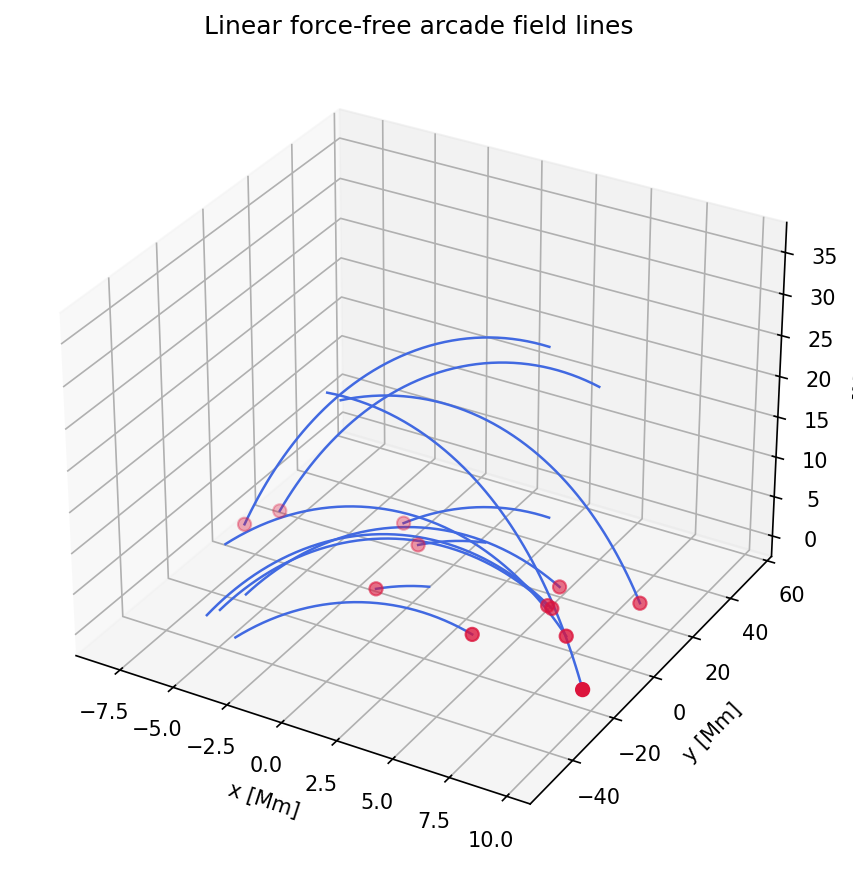

Arcade Field Demo
=================

This page demonstrates how to use ``wind3d_field_lines`` to trace and visualize
magnetic field lines in a linear force-free arcade field.

Physics model
-------------

Given arcade half-width :math:`L_a`, vertical decay length :math:`a`, and field
strength scale :math:`B_a`, the dimensionless parameters are:

.. math::

   k = \frac{\pi}{2L_a},\quad
   C = \frac{2L_a}{\pi a},\quad
   S = \sqrt{1 - C^2}

The three magnetic-field components on a right-handed Cartesian grid
:math:`(x, y, z)` — with :math:`z` pointing upward and the polarity inversion
line along :math:`x = 0` — are:

.. math::

   B_x = -C B_a \cos(kx)\, e^{-z/a},\quad
   B_y = -S B_a \cos(kx)\, e^{-z/a},\quad
   B_z =    B_a \sin(kx)\, e^{-z/a}

Default parameters (coordinates in Mm, field amplitude in G):

- :math:`B_a = 6\,\text{G}`
- :math:`L_a = 12\,\text{Mm}`
- :math:`a   = 30\,\text{Mm}`

The model is valid only when :math:`C = 2L_a/(\pi a) \leq 1`.

Step-by-step tracing example
-----------------------------

The following example traces magnetic field lines by importing the module
directly, without any command-line call.

**1. Build the grid and field**

.. code-block:: python

   import numpy as np
   from wind3d_field_lines.demo_arcade import build_arcade_field

   # Define a regular Cartesian grid (coordinates in Mm)
   x = np.linspace(-12.0, 12.0, 65)
   y = np.linspace(-40.0, 40.0, 65)
   z = np.linspace(0.0, 65.0, 65)

   # Compute the analytic linear force-free arcade field
   bx, by, bz = build_arcade_field(ba=6.0, la=12.0, decay_a=30.0, x=x, y=y, z=z)
   print(bx.shape)  # (65, 65, 65)

**2. Prepare seed points and grid spacings**

.. code-block:: python

   from wind3d_field_lines import trace_field_lines

   dx = float(x[1] - x[0])
   dy = float(y[1] - y[0])
   dz = float(z[1] - z[0])

   # Grid-spacing profiles along z (uniform here)
   dx_profile = np.full(z.size, dx)
   dy_profile = np.full(z.size, dy)
   dz_profile = np.full(z.size, dz)

   # Scatter 12 seed points randomly over the photospheric base (z = 0)
   rng = np.random.default_rng(42)
   seed_x = rng.uniform(-10.0, 10.0, 12)
   seed_y = rng.uniform(-24.0, 24.0, 12)
   seed_z = np.zeros(12)

   # Convert physical coordinates to 1-based grid indices
   icen = (seed_x - x[0]) / dx + 1.0
   jcen = (seed_y - y[0]) / dy + 1.0
   kcen = (seed_z - z[0]) / dz + 1.0

**3. Trace the field lines**

.. code-block:: python

   result = trace_field_lines(
       bx=bx, by=by, bz=bz,
       dx=dx_profile, dy=dy_profile, dz=dz_profile,
       icen_bln=icen, jcen_bln=jcen, kcen_bln=kcen,
       lcen_bln=51,   # centre index along each traced line
       lx_bln=101,    # total number of points per line
   )
   # result.i/j/k  : traced grid indices, shape (n_seeds, lx_bln)
   # result.lmin/lmax : valid range for each line

**4. Visualize with matplotlib**

.. code-block:: python

   import matplotlib.pyplot as plt

   # Convert grid indices back to physical coordinates
   x_line = x[0] + (result.i - 1.0) * dx
   y_line = y[0] + (result.j - 1.0) * dy
   z_line = z[0] + (result.k - 1.0) * dz

   fig = plt.figure(figsize=(9, 7))
   ax = fig.add_subplot(111, projection="3d")

   for n in range(result.nx):
       lmin = int(max(1, result.lmin[n]))
       lmax = int(min(result.lx, result.lmax[n]))
       if lmax - lmin + 1 < 2:
           continue
       ax.plot(
           x_line[n, lmin - 1 : lmax],
           y_line[n, lmin - 1 : lmax],
           z_line[n, lmin - 1 : lmax],
           color="royalblue", linewidth=1.2,
       )

   ax.scatter(seed_x, seed_y, seed_z, color="crimson", s=40)
   ax.set_xlabel("x [Mm]")
   ax.set_ylabel("y [Mm]")
   ax.set_zlabel("z [Mm]")
   ax.set_title("Linear force-free arcade field lines")
   plt.show()

You can also call :func:`~wind3d_field_lines.demo_arcade.run_demo` with an
:class:`~wind3d_field_lines.demo_arcade.ArcadeDemoConfig` to run all of the
above steps at once:

.. code-block:: python

   from wind3d_field_lines.demo_arcade import ArcadeDemoConfig, run_demo

   run_demo(ArcadeDemoConfig())                          # interactive
   run_demo(ArcadeDemoConfig(output="arcade_demo.png"))  # save to file

Visualization
-------------

   Magnetic field lines of the linear force-free arcade (blue) traced from
   12 randomly scattered seed points at the photospheric base (red dots).
   Coordinates are in Mm; field amplitude scale is 6 G.

Notes
-----

- If :math:`2L_a / (\pi a) > 1`, the model is invalid and
  :func:`~wind3d_field_lines.demo_arcade.build_arcade_field` raises a
  :exc:`ValueError`.
- The analytic field is independent of :math:`y` by construction; the
  :math:`y` dimension is retained so that the full 3-D tracer can be used
  without modification.
