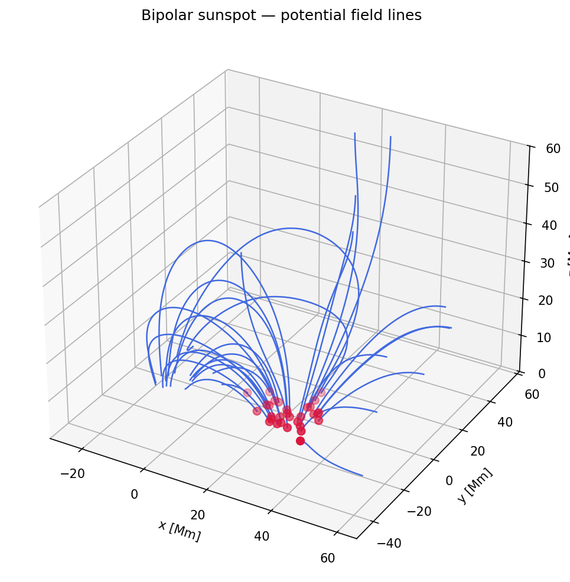

Bipolar Sunspot Demo
====================

This page demonstrates how to use ``wind3d_field_lines`` to extrapolate a
potential magnetic field from a bipolar sunspot configuration and trace the
resulting field lines.

Physics model
-------------

The lower boundary (photosphere, :math:`z = 0`) is prescribed with a
superposition of two Gaussian magnetic concentrations of opposite polarity,
placed symmetrically at :math:`x = \pm d`:

.. math::

   B_z(x, y, 0) = B_0
   \left[
     \exp\!\left(-\frac{(x-d)^2 + y^2}{2\sigma^2}\right)
     -
     \exp\!\left(-\frac{(x+d)^2 + y^2}{2\sigma^2}\right)
   \right]

The potential field :math:`\mathbf{B} = -\nabla\Psi` that matches this
boundary condition is obtained by solving the Laplace equation
:math:`\nabla^2\Psi = 0` using
:func:`~wind3d_field_lines.compute_potential_field`
(see :doc:`theory_potential_field`).

Default parameters (coordinates in Mm, field amplitude in G):

- :math:`B_0 = 100\,\text{G}` — peak field strength
- :math:`\sigma = 8\,\text{Mm}` — Gaussian width
- :math:`d = 20\,\text{Mm}` — half-distance between the two spots

Step-by-step example
---------------------

**1. Build the surface boundary field**

.. code-block:: python

   import numpy as np
   from wind3d_field_lines.demo_bipolar import build_bipolar_surface_field

   x = np.linspace(-60.0, 60.0, 128)
   y = np.linspace(-60.0, 60.0, 128)

   bzt_bottom = build_bipolar_surface_field(
       b0=100.0, sigma=8.0, spot_distance=20.0, x=x, y=y
   )
   print(bzt_bottom.shape)  # (128, 128)

**2. Extrapolate the potential field**

.. code-block:: python

   from wind3d_field_lines import compute_potential_field

   nz = 64
   lzt = 60.0              # domain height [Mm]
   dxi = float(x[1] - x[0])
   det = float(y[1] - y[0])

   bxi, bet, bzt = compute_potential_field(
       bzt_bottom=bzt_bottom,
       dxi=dxi, det=det,
       lzt=lzt, kx=nz,
       hxi=np.ones(nz),   # Cartesian: h = 1
       het=np.ones(nz),
       hzt=np.ones(nz),
   )
   print(bzt.shape)  # (128, 128, 64)

**3. Trace field lines from the positive polarity**

.. code-block:: python

   from wind3d_field_lines import trace_field_lines

   dz_step = lzt / (nz - 0.5)
   dx_profile = np.full(nz, dxi)
   dy_profile = np.full(nz, det)
   dz_profile = np.full(nz, dz_step)

   rng = np.random.default_rng(42)
   seed_x = rng.uniform(4.0, 48.0, 30)   # positive polarity side (x > 0)
   seed_y = rng.uniform(-42.0, 42.0, 30)
   seed_z = np.zeros(30)

   icen = (seed_x - x[0]) / dxi + 1.0
   jcen = (seed_y - y[0]) / det + 1.0
   kcen = seed_z / dz_step + 1.0

   result = trace_field_lines(
       bx=bxi, by=bet, bz=bzt,
       dx=dx_profile, dy=dy_profile, dz=dz_profile,
       seed_i=icen, seed_j=jcen, seed_k=kcen,
       line_center=301, line_length=601, margin=0,
   )

**4. Visualize**

.. code-block:: python

   import matplotlib.pyplot as plt

   x_line = x[0] + (result.i - 1.0) * dxi
   y_line = y[0] + (result.j - 1.0) * det
   z_line = (result.k - 1.0) * dz_step

   fig = plt.figure(figsize=(10, 8))
   ax = fig.add_subplot(111, projection="3d")

   xx, yy = np.meshgrid(x, y, indexing="ij")
   vmax = float(np.abs(bzt_bottom).max())
   ax.contourf(xx, yy, bzt_bottom, levels=30,
               zdir="z", offset=0.0, cmap="RdBu_r",
               vmin=-vmax, vmax=vmax, alpha=0.85)

   for n in range(result.num_lines):
       lmin = int(max(1, result.lmin[n]))
       lmax = int(min(result.line_length, result.lmax[n]))
       if lmax - lmin + 1 < 2:
           continue
       ax.plot(x_line[n, lmin-1:lmax], y_line[n, lmin-1:lmax],
               z_line[n, lmin-1:lmax], color="royalblue", linewidth=1.2)

   ax.scatter(seed_x, seed_y, seed_z, color="crimson", s=40)
   ax.set_xlabel("x [Mm]")
   ax.set_ylabel("y [Mm]")
   ax.set_zlabel("z [Mm]")
   plt.show()

You can also call :func:`~wind3d_field_lines.demo_bipolar.run_demo` with a
:class:`~wind3d_field_lines.demo_bipolar.BipolarDemoConfig` to run all steps
at once:

.. code-block:: python

   from wind3d_field_lines.demo_bipolar import BipolarDemoConfig, run_demo

   run_demo(BipolarDemoConfig())                           # interactive
   run_demo(BipolarDemoConfig(output="bipolar_demo.png"))  # save to file

Visualization
-------------

   Potential magnetic field lines (blue) traced from 30 seed points (red dots)
   on the positive polarity side.  The surface colour map shows
   :math:`B_z(x,y,0)` (red = positive, blue = negative).
